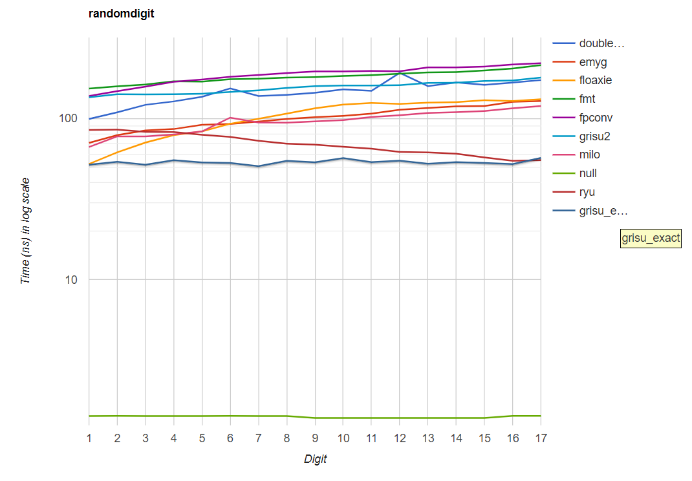

# Grisu-Exact
A variant of Grisu algorithm producing the shortest and correctly rounded output always, inspired by Ryu algorithm

# Introduction
This algorithm generates a pair of integers from a floating-point number. These integers are the decimal significand and the exponent of the input floating-point number. Actual string generation from these integers is not officially a part of this algorithm. It is also included, but subject to change.

The algorithm guarantees three things:

1) It has the roundtrip guarantee; that is, a correct parser interprets the generated output string as the original input floating-point number.

2) The output is of the shortest length; that is, no other output strings that are interpreted as the input number can contain less digits than the output of Grisu-Exact.

3) The output is correctly rounded: the number generated by Grisu-Exact is the closest to the actual value of the input number among possible minimum-length outputs.

# How to Use
(This section will be updated soon)

There are three files you might want to include: ````grisu_exact.h````, ````fp_to_chars.h````, and ````fp_to_chars.cpp````. The first file includes the Grisu-Exact algorithm, and the other two are about string generation. Other files are just for testing/benchmarking. There is no dependency other than the standard library. Be aware that ````grisu_exact.h```` uses some C++17 features (````if constexpr````, for example).

# Performance
In my machine, it defeats or is on par with other contemporary algorithms including Ryu. Especially, Grisu-Exact is much faster than Ryu if the output string contains small number of digits. It is slightly slower than Ryu when the output string contains the maximum possible number of digits.



# Comprehensive Explanation of the Algorithm
Please see [this file](https://github.com/jk-jeon/Grisu-Exact/blob/master/other_files/Grisu-Exact.pdf).

# Notes
This library is not yet production-ready. Use it with your own risk.

# License
MIT
