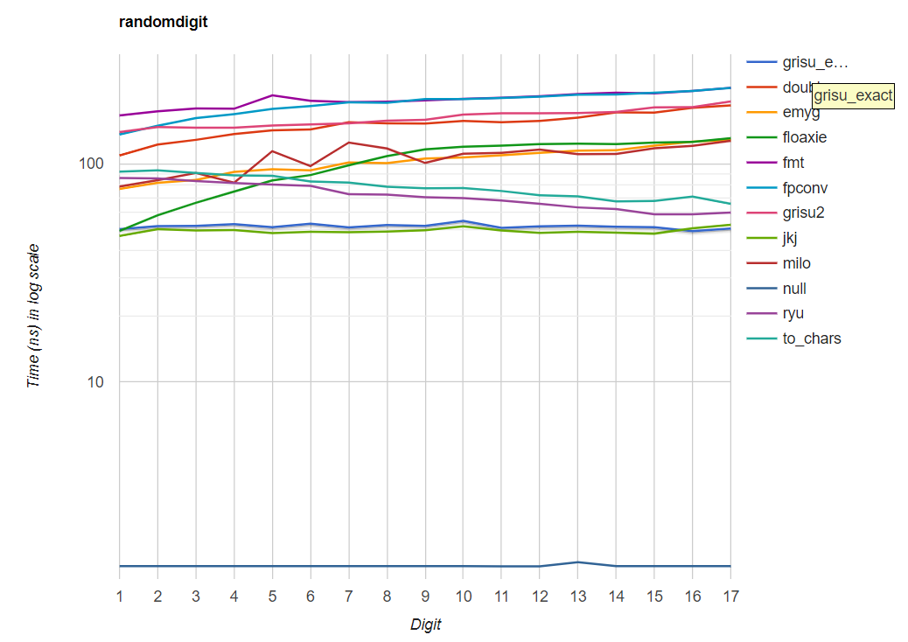

# Grisu-Exact
A variant of Grisu algorithm producing the shortest output always, inspired by Ryu algorithm

# Introduction
This algorithm generates a pair of integers from a floating-point number. These integers are the decimal significand and the exponent of the input floating-point number. Actual string generation from these integers is currently not included. It will be included later.

The algorithm guarantees two things:

1) It has the roundtrip guarantee; that is, a correct parser interprets the generated output string as the original input floating-point number.

2) The output is of the shortest length; that is, no other output strings that are interpreted as the input number can contain less digits than the output of Grisu-Exact.

Note that currently there is no correct rounding guarantee: the number generated by Grisu-Exact may not be the closest to the actual value of the input number among possible minimum-length outputs.

# How to Use
You can just drop ````grisu_exact.h```` in your include directory and include it. That's it. Other ````.h/.cpp```` files are just for the testing purpose, and not necessary for any real use. Also, there is no dependency other than the standard library.
But please be aware that ````grisu_exact.h```` uses some C++17 features (````if constexpr````, for example).

# Performance
In my machine, it defeats other contemporary algorithms including Ryu. Especially, Grisu-Exact is much faster than Ryu if the output string contains less digits. It is almost on par with Ryu when the output string contains the maximum possible number of digits. However, as noted before Grisu-Exact currently does not offer correct rounding guarantee. After implementing additional codes that will give this guarantee, it may become slower than now. I will let users to optionally disable this feature for better performance.



# Comprehensive Explanation of the Algorithm
In preparation.

# Notes
There are currently some errors in the correctness proof. Altough I believe I can fix them shortly, this library is by no mean production-ready. Use it with your own risk.

# License
MIT
