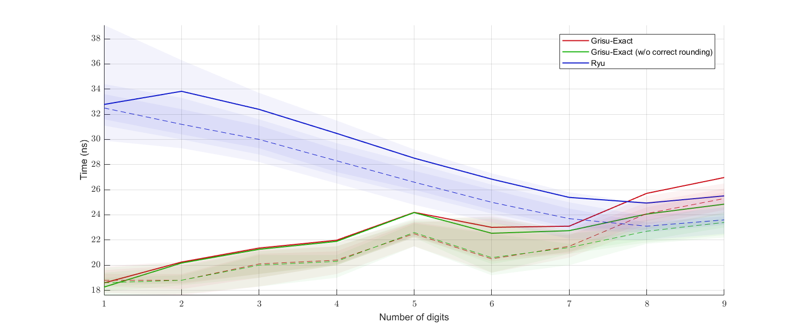
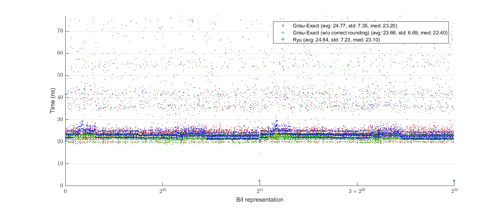

# Grisu-Exact
A variant of Grisu algorithm producing the shortest and correctly rounded output always, inspired by Ryu algorithm

# Introduction
This algorithm generates a pair of integers from a floating-point number: the decimal significand and the decimal exponent of the input floating-point number. These integers can then be used for string generation of decimal representation of the input floating-point number, the procedure commonly called ````ftoa```` or ````dtoa````.

The algorithm guarantees three things:

1) It has the roundtrip guarantee; that is, a correct parser interprets the generated output string as the original input floating-point number.

2) The output is of the shortest length; that is, no other output strings that are interpreted as the input number can contain less digits than the output of Grisu-Exact.

3) The output is correctly rounded: the number generated by Grisu-Exact is the closest to the actual value of the input number among possible minimum-length outputs.

# How to Use
Although Grisu-Exact is intended for float-to-string conversion routines, the actual string generation is not officially a part of the algorithm. Grisu-Exact just outputs two integers (the decimal significand/exponent) that can be consumed by a string generation procedure. The header file ````grisu_exact.h```` includes everything needed for this. It is header-only; you just need to drop it in your include directory and ````#include```` it.

Nevertheless, a string generation procedure is included in the library: ````fp_to_chars.h```` and ````fp_to_chars/fp_to_chars.cpp```` are files for that procedure. If you want to use them too, then you need to (1) Drop ````grisu_exact.h```` and ````fp_to_chars.h```` in your include directory, (2) ````#include```` the file ````fp_to_chars.h````,  (3) Build ````fp_to_chars/fp_to_chars.cpp```` as a library, and then (4) Link against it. Note, however, that features provided in ````fp_to_chars.h/cpp```` are quite limited and subject to change. Currently, there is no way to indicate any formatting options. Every float/double input is just printed as something like ````(-)x.xxxxxxE(-)xxx````. For example, there is no way to put plus sign (+) for positive numbers or positive exponents, change ````E```` to ````e````, or print in a fixed-point form, or etc.. Also there is no way to precompute the required size of buffer. I don't like this rigidity, and hope to add more customization features later.

Besides these three, any other files are unncessary for real use.

The library uses some C++17 features (e.g., ````constexpr````).

A comprehensive reference for this library is in preparation.

# Usage Examples
(Simple string generation from ````float/double````)
````
#include "fp_to_chars.h"
double x = 1.234;  // Also works for float
char buffer[31];   // Should be long enough

// Null-terminate the buffer and return the pointer to the null character
// Hence, the length of the string is (end_ptr - buffer)
// buffer is now { '1', '.', '2', '3', '4', 'E', '0', '\0', (garbages) }
char* end_ptr = jkj::fp_to_chars(x, buffer);

// Does not null-terminate the buffer; returns the next-to-end pointer
// buffer is now { '1', '.', '2', '3', '4', 'E', '0', (garbages) }
// you can wrap the buffer with things like std::string_view
end_ptr = jkj::fp_to_chars_n(x, buffer);
````

(Direct use of ````jkj::grisu_exact````)
````
#include "grisu_exact.h"
double x = 1.234;   // Also works for float

// v is a struct with three members:
// significand : decimal significand (1234 in this case);
                 it is of type std::uint64_t for double, std::uint32_t for float
//    exponent : decimal exponent (-3 in this case); it is of type int
// is_negative : as the name suggests; it is of type bool
auto v = jkj::grisu_exact(x);
````

# Performance
In my machine, it defeats or is on par with other contemporary algorithms including Ryu. Especially, Grisu-Exact is much faster than Ryu if the output string contains small number of digits. It can perform slightly slower or faster depending on the situation than Ryu when the output string contains near the maximum possible number of digits.

The following benchmark result is obtained using Milo's dtoa benchmark framework ([https://github.com/miloyip/dtoa-benchmark](https://github.com/miloyip/dtoa-benchmark)). The source code is available [here](https://github.com/jk-jeon/dtoa-benchmark).


There is also another benchmark done by myself:


(top: benchmark for ````float```` data, bottom: benchmark for ````double```` data)

Here is another performance plot with uniformly randomly generated ````float````(top) or ````double````(bottom) data:



# Comprehensive Explanation of the Algorithm
Please see [this file](https://github.com/jk-jeon/Grisu-Exact/blob/master/other_files/Grisu-Exact.pdf).

# Notes
This library is not yet production-ready. Use it with your own risk.

# License
MIT
