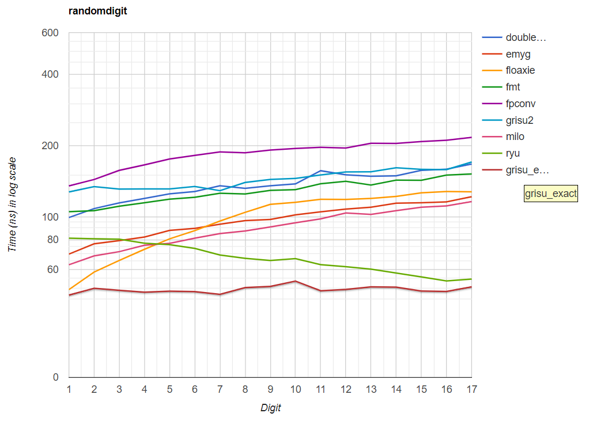
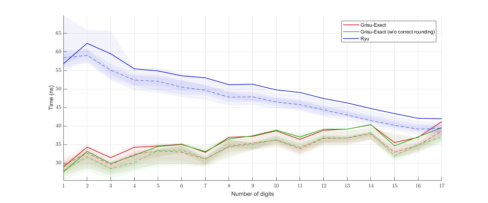
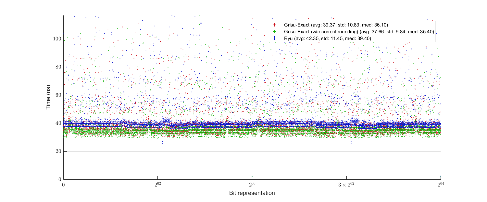

# Grisu-Exact
This library is a reference implementation of Grisu-Exact in C++.

Grisu-Exact is a variant of [Grisu](https://www.cs.tufts.edu/~nr/cs257/archive/florian-loitsch/printf.pdf). Unlike Grisu, Grisu-Exact always produces shortest and correctly rounded outputs. Development of this algorithm was inspired by [Ryu](https://www.researchgate.net/publication/329410883_Ryu_fast_float-to-string_conversion).


# Introduction
Grisu-Exact generates a pair of integers from a floating-point number: the decimal significand and the decimal exponent of the input floating-point number. These integers can then be used for string generation of decimal representation of the input floating-point number, the procedure commonly called ````ftoa```` or ````dtoa````.

The algorithm guarantees three things:

1) It has the roundtrip guarantee; that is, a correct parser interprets the generated output string as the original input floating-point number.

2) The output is of the shortest length; that is, no other output strings that are interpreted as the input number can contain less digits than the output of Grisu-Exact.

3) The output is correctly rounded: the number generated by Grisu-Exact is the closest to the actual value of the input number among possible minimum-length outputs.

# How to Use
Although Grisu-Exact is intended for float-to-string conversion routines, the actual string generation is not officially a part of the algorithm. Grisu-Exact just outputs two integers (the decimal significand/exponent) that can be consumed by a string generation procedure. The header file [`grisu_exact.h`](grisu_exact.h) includes everything needed for this. It is header-only; you just need these two steps for using it:

1) Drop [`grisu_exact.h`](grisu_exact.h) in your include directory, and
2) `#include` it. That's it.

Nevertheless, a string generation procedure is included in the library. There are two additional files needed for that: [`fp_to_chars.h`](fp_to_chars.h) and [`fp_to_chars.cpp`](fp_to_chars/fp_to_chars.cpp) (the `.cpp` file is in the directory [`fp_to_chars`](fp_to_chars)). If you want to use them too, then:

1) In addition to [`grisu_exact.h`](grisu_exact.h), drop [`fp_to_chars.h`](fp_to_chars.h) in your include directory,
2) `#include` [`fp_to_chars.h`](fp_to_chars.h) instead of [`grisu_exact.h`](grisu_exact.h),
3) Build [`fp_to_chars.cpp`](fp_to_chars/fp_to_chars.cpp) as a library, and then
4) Link against it.

However, note that features provided in [`fp_to_chars.h`](fp_to_chars.h)/[`.cpp`](fp_to_chars/fp_to_chars.cpp) are quite limited and subject to change. Currently, there is no way to indicate any formatting options. Every float/double input is just printed as something like `-3.34E3`. No option for putting plus sign (+) in front of positive significands or positive exponents, no way to use `e` instead of `E`, no option for printing in a fixed-point form (like `-3340`), etc.. Also there is no way to precompute the minimum required size of buffer. I don't like this rigidity, and hope to add more customization features later. Yet, you can rather use `grisu_exact.h` directly to implement your own string generation routine.

Besides these three, any other files are unncessary for real use.

The library uses some C++17 features (e.g., `if constexpr`), so you need C++17 compilers if you want to use this library.

A comprehensive reference for this library is in preparation.

# Usage Examples
(Simple string generation from `float/double`)
```cpp
#include "fp_to_chars.h"
double x = 1.234;  // Also works for float
char buffer[31];   // Should be long enough

// Null-terminate the buffer and return the pointer to the null character
// Hence, the length of the string is (end_ptr - buffer)
// buffer is now { '1', '.', '2', '3', '4', 'E', '0', '\0', (garbages) }
char* end_ptr = jkj::fp_to_chars(x, buffer);

// Does not null-terminate the buffer; returns the next-to-end pointer
// buffer is now { '1', '.', '2', '3', '4', 'E', '0', (garbages) }
// you can wrap the buffer with things like std::string_view
end_ptr = jkj::fp_to_chars_n(x, buffer);
```

(Direct use of `jkj::grisu_exact`)
```cpp
#include "grisu_exact.h"
double x = 1.234;   // Also works for float

// Here, x should be a nonzero finite number!
// The return value v is a struct with three members:
// significand : decimal significand (1234 in this case);
//               it is of type std::uint64_t for double, std::uint32_t for float
//    exponent : decimal exponent (-3 in this case); it is of type int
// is_negative : as the name suggests; it is of type bool
auto v = jkj::grisu_exact(x);
```

# Performance
In my machine, it defeats or is on par with other contemporary algorithms including Ryu. Especially, Grisu-Exact is much faster than Ryu if the output string contains small number of digits. It can perform slightly slower or faster depending on the situation than Ryu when the output string contains near the maximum possible number of digits.

The following benchmark result is obtained using Milo's dtoa benchmark framework ([https://github.com/miloyip/dtoa-benchmark](https://github.com/miloyip/dtoa-benchmark)). The complete source code for the benchmark below is available [here](https://github.com/jk-jeon/dtoa-benchmark).



There is also a benchmark done by myself:


(top: benchmark for ````float```` data, bottom: benchmark for ````double```` data)

Here is another performance plot with uniformly randomly generated ````float````(top) or ````double````(bottom) data:



Information about these benchmarks can be found in Section 5 of [this paper](https://github.com/jk-jeon/Grisu-Exact/blob/master/other_files/Grisu-Exact.pdf).

# Comprehensive Explanation of the Algorithm
Please see [this paper](https://github.com/jk-jeon/Grisu-Exact/blob/master/other_files/Grisu-Exact.pdf).

# How to Run Tests
In order to run tests and benchmarks, you need `.cpp/.h` files in the directories [`tests`](tests) and [`benchmarks`](benchmarks), in addition to [`grisu_exact.h`](grisu_exact.h), [`fp_to_chars.h`](fp_to_chars.h), and [`fp_to_chars.cpp`](fp_to_chars/fp_to_chars.cpp).

In [`main.cpp`](main.cpp) (which is in [`tests`](tests) directory), there are bunch of `#define`'s. Uncomment whatever you want to test or benchmark, compile and link every `.cpp` files mentioned.

The result of tests and benchmarks will be written in the directories [`test_results`](test_results) and [`becnhmark_results`](benchmark_results) respectively, and as `std::ofstream` cannot create a new directory, those directories should exist before running the test.

There are also some MATLAB scripts in the directory [`benchmark_results`](benchmark_results) for plot generation. If you have MATLAB installed on your machine and want to generate plots, then download these script files also.

# Notes
This library is not yet production-ready. Use it with your own risk.

# License
All code, except for those belong to third-party libraries (code in [`benchmark/ryu`](benchmark/ryu) and [`benchmark_results/shaded_plots`](benchmark_results/shaded_plots)), is licensed under either of

 * Apache License Version 2.0 with LLVM Exceptions ([LICENSE-Apache2-LLVM](LICENSE-Apache2-LLVM) or https://llvm.org/foundation/relicensing/LICENSE.txt) or
 * Boost Software License Version 1.0 ([LICENSE-Boost](LICENSE-Boost) or https://www.boost.org/LICENSE_1_0.txt).

except for the file [`fp_to_chars.cpp`](fp_to_chars/fp_to_chars.cpp), which is licensed under either of

 * Apache License Version 2.0 ([LICENSE-Apache2](fp_to_chars/LICENSE-Apache2) or http://www.apache.org/licenses/LICENSE-2.0) or
 * Boost Software License Version 1.0 ([LICENSE-Boost](fp_to_chars/LICENSE-Boost) or https://www.boost.org/LICENSE_1_0.txt).
 
 
